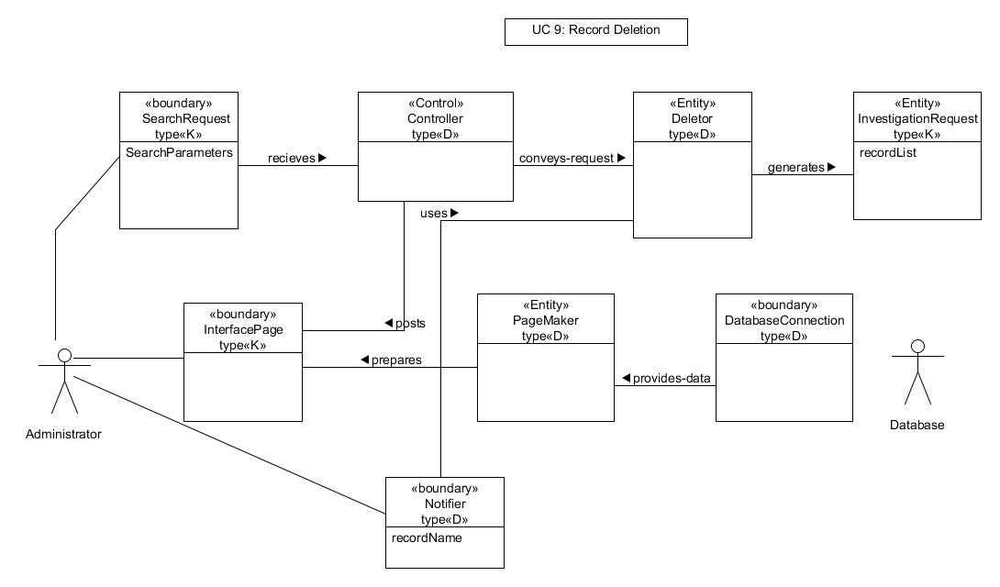
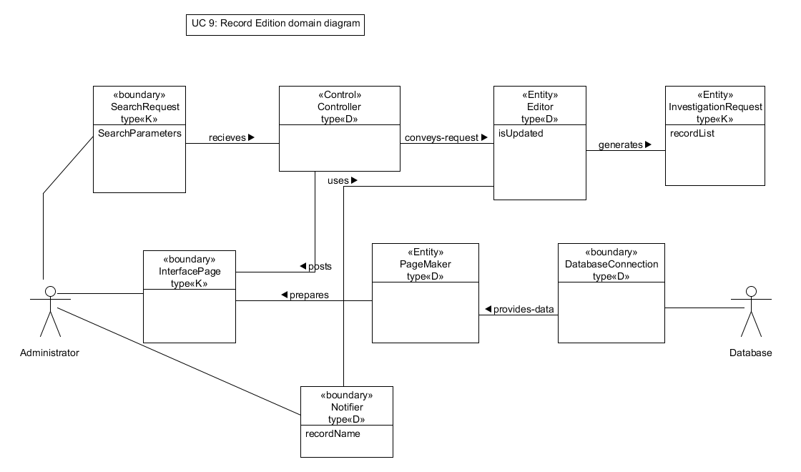

<table align="center" width="810" height="644" ">
  <tr>
    <td><table border="1" cellspacing="0" cellpadding="0" align="left">
      <tr>
        <td width="623" colspan="3" valign="top">
<strong>Archiving</strong>

          
 UC-2  :Responsibility
</td>
      </tr>
      <tr>
        <td width="431" valign="top">
Responsibility Description
</td>
        <td width="48" valign="top">
Type
</td>
        <td width="144" valign="top">
Concept name
</td>
      </tr>
      <tr>
        <td width="431" valign="top">
Coordinate    actions of concepts associated with this use case and delegate the work to    other concepts.
</td>
        <td width="48" valign="top">
D
</td>
        <td width="144" valign="top">
Controller
</td>
      </tr>
      <tr>
        <td width="431" valign="top">
HTML    document that displays what actions can be done.
</td>
        <td width="48" valign="top">
K
</td>
        <td width="144" valign="top">
Interface    Page
</td>
      </tr>
      <tr>
        <td width="431" valign="top">
A    form specifying the new record details.
</td>
        <td width="48" valign="top">
K
</td>
        <td width="144" valign="top">
Archive    Page
</td>
      </tr>
      <tr>
        <td width="431" valign="top">
Queries    the database to store the new record and its details. 
</td>
        <td width="48" valign="top">
D
</td>
        <td width="144" valign="top">
Archiver
</td>
      </tr>
      <tr>
        <td width="431" valign="top">
A    query to the database to create a new record in the database.
</td>
        <td width="48" valign="top">
D
</td>
        <td width="144" valign="top">
Database    Connection
</td>
      </tr>
      <tr>
        <td width="431" valign="top">
Notify    user about the result of the process
</td>
        <td width="48" valign="top">
D
</td>
        <td width="144" valign="top">
Notifier
</td>
      </tr>
    </table></td>
  </tr>
  <tr>
    <td><table border="1" cellspacing="0" cellpadding="0" align="left">
      <tr>
        <td width="623" colspan="3" valign="top">
UC-2 Association
</td>
      </tr>
      <tr>
        <td width="216" valign="top">
Concept pair
</td>
        <td width="294" valign="top">
Association description
</td>
        <td width="114" valign="top">
Association name 
</td>
      </tr>
      <tr>
        <td width="216">
Archive    Page ↔ Controller
</td>
        <td width="294" valign="top">
Archive    Page passes the new record parameters to the Controller
</td>
        <td width="114">
Conveys    Request
</td>
      </tr>
      <tr>
        <td width="216">
Controller    ↔ Archiver
</td>
        <td width="294" valign="top">
Controller    passes the new record parameters to the Archiver
</td>
        <td width="114">
Conveys    Request
</td>
      </tr>
      <tr>
        <td width="216">
Archiver    ↔ Database Connection
</td>
        <td width="294" valign="top">
Archiver    passes the queries to the Database Connection. 
</td>
        <td width="114">
Requests    Query
</td>
      </tr>
      <tr>
        <td width="216">
Database    Connection  ↔ Notifier
</td>
        <td width="294" valign="top">
Database    connection informs the notifier about the result of process of record    creation
</td>
        <td width="114">
Informs
</td>
      </tr>
      <tr>
        <td width="216">
Notifier    ↔ Interface Page
</td>
        <td width="294" valign="top">
Notifier    passes the process result message to the Interface page to display.
</td>
        <td width="114">
Displays
</td>
      </tr>
    </table></td>
  </tr>
  <tr>
    <td><table border="1" cellspacing="0" cellpadding="0" align="left">
      <tr>
        <td width="623" colspan="3" valign="top">
UC-2 Attributes
</td>
      </tr>
      <tr>
        <td width="134" valign="top">
Concept
</td>
        <td width="120" valign="top">
Attributes
</td>
        <td width="369" valign="top">
Attribute Description
</td>
      </tr>
      <tr>
        <td width="134" valign="top">
Archiver
</td>
        <td width="120" valign="top">
Record parameters
</td>
        <td width="369" valign="top">
Name, Category, ID, Date (publish, archive, recording), tag
</td>
      </tr>
    </table></td>
  </tr>
  <tr>
    <td></td>
  </tr>
  <tr>
    <td> </td>
  </tr>
  <tr>
    <td><table border="1" cellspacing="0" cellpadding="0" align="left">
      <tr>
        <td width="623" colspan="3" valign="top">
<strong>Search</strong>

          
UC-3 Responsibility
</td>
      </tr>
      <tr>
        <td width="431" valign="top">
Responsibility Description
</td>
        <td width="48" valign="top">
Type
</td>
        <td width="144" valign="top">
Concept name
</td>
      </tr>
      <tr>
        <td width="431" valign="top">
Coordinate    actions of concepts associated with this use case and delegate the work to    other concepts.
</td>
        <td width="48" valign="top">
D
</td>
        <td width="144" valign="top">
Controller
</td>
      </tr>
      <tr>
        <td width="431" valign="top">
HTML    document that displays what actions can be done.
</td>
        <td width="48" valign="top">
K
</td>
        <td width="144" valign="top">
Interface    Page
</td>
      </tr>
      <tr>
        <td width="431" valign="top">
Form    specifying the Search parameters for data retrieval from the database.
</td>
        <td width="48" valign="top">
K
</td>
        <td width="144" valign="top">
Search    Page
</td>
      </tr>
      <tr>
        <td width="431" valign="top">
Retrieves    the records from the database.
</td>
        <td width="48" valign="top">
D
</td>
        <td width="144" valign="top">
Searcher
</td>
      </tr>
      <tr>
        <td width="431" valign="top">
Render    the retrieved records into an HTML document for sending to actor&rsquo;s Web    browser for display.
</td>
        <td width="48" valign="top">
D
</td>
        <td width="144" valign="top">
Page    Maker
</td>
      </tr>
      <tr>
        <td width="431" valign="top">
A    query to the database that matches the actor&rsquo;s search criteria and retrieve    the records.
</td>
        <td width="48" valign="top">
D
</td>
        <td width="144" valign="top">
Database    Connection
</td>
      </tr>
      <tr>
        <td width="431" valign="top">
The    selected record can be previewed to the user.
</td>
        <td width="48" valign="top">
D
</td>
        <td width="144" valign="top">
Media    Player
</td>
      </tr>
      <tr>
        <td width="431" valign="top">
The    selected record can be downloaded by the user.
</td>
        <td width="48" valign="top">
D
</td>
        <td width="144" valign="top">
Media    Downloader
</td>
      </tr>
    </table></td>
  </tr>
  <tr>
    <td> </td>
  </tr>
  <tr>
    <td><table border="1" cellspacing="0" cellpadding="0" align="left" width="630">
      <tr>
        <td width="630" colspan="3" valign="top">
UC-3 Association
</td>
      </tr>
      <tr>
        <td width="156" valign="top">
Concept pair
</td>
        <td width="342" valign="top">
Association description
</td>
        <td width="132" valign="top">
Association name 
</td>
      </tr>
      <tr>
        <td width="156" valign="top">
Controller ↔ Interface Page
</td>
        <td width="342" valign="top">
Controller prepares the interface page to be displayed for the user.    And receives the search parameters.
</td>
        <td width="132" valign="top">
Displays
</td>
      </tr>
      <tr>
        <td width="156" valign="top">
Controller ↔ Search Request
</td>
        <td width="342" valign="top">
Controller passes the search parameters to the Search Request.
</td>
        <td width="132" valign="top">
Conveys Request
</td>
      </tr>
      <tr>
        <td width="156" valign="top">
Search Request ↔ Database Connection
</td>
        <td width="342" valign="top">
Search request asks the database connection to retrieve the matching    records from the database.
</td>
        <td width="132" valign="top">
Retrieves Records
</td>
      </tr>
      <tr>
        <td width="156" valign="top">
Database Connection ↔ Page Maker
</td>
        <td width="342" valign="top">
Database Connection passes the retrieved data to Page Maker to render    them for display
</td>
        <td width="132" valign="top">
Provides Data
</td>
      </tr>
      <tr>
        <td width="156" valign="top">
Page Maker ↔ Interface Page
</td>
        <td width="342" valign="top">
Page Maker prepares the Interface Page to display the list of    retrieved records for the user
</td>
        <td width="132" valign="top">
Displays
</td>
      </tr>
      <tr>
        <td width="156" valign="top">
Interface Page ↔ Controller
</td>
        <td width="342" valign="top">
Interface Page conveys play request to the Controller
</td>
        <td width="132" valign="top">
Requests Play
</td>
      </tr>
      <tr>
        <td width="156" valign="top">
Controller ↔ Media Player
</td>
        <td width="342" valign="top">
Controller conveys the record to be displayed by Media Player, if    selected
</td>
        <td width="132" valign="top">
Conveys Data
</td>
      </tr>
      <tr>
        <td width="156" valign="top">
Controller ↔  Media Downloader
</td>
        <td width="342" valign="top">
Controller conveys the record to be downloaded to the user specified    location, if selected
</td>
        <td width="132" valign="top">
Conveys Data
</td>
      </tr>
    </table></td>
  </tr>
  <tr>
    <td> </td>
  </tr>
  <tr>
    <td><table border="1" cellspacing="0" cellpadding="0" align="left">
      <tr>
        <td width="623" colspan="3" valign="top">
UC-3 Attributes
</td>
      </tr>
      <tr>
        <td width="144" valign="top">
Concept
</td>
        <td width="138" valign="top">
Attributes
</td>
        <td width="342" valign="top">
Attribute Description
</td>
      </tr>
      <tr>
        <td width="144" valign="top">
Search Request
</td>
        <td width="138" valign="top">
Search parameters
</td>
        <td width="342" valign="top">
General, Specified Date, Tag, Category and Name
</td>
      </tr>
      <tr>
        <td width="144" valign="top">
Media Player
</td>
        <td width="138" valign="top">
File path
</td>
        <td width="342" valign="top">
Used to specify the location of the file.
</td>
      </tr>
      <tr>
        <td width="144" valign="top">
Media Downloader
</td>
        <td width="138" valign="top">
File path
</td>
        <td width="342" valign="top">
Used to specify the location of the file.
</td>
      </tr>
    </table></td>
  </tr>
  <tr>
    <td> </td>
  </tr>
  <tr>
    <td></td>
  </tr>
  <tr>
    <td> </td>
  </tr>
  <tr>
    <td><table border="1" cellspacing="0" cellpadding="0" align="left">
      <tr>
        <td width="623" colspan="3" valign="top">
<strong>Report</strong>

          
UC-4 Responbisility
</td>
      </tr>
      <tr>
        <td width="431" valign="top">
Responsibility Description
</td>
        <td width="48" valign="top">
Type
</td>
        <td width="144" valign="top">
Concept name
</td>
      </tr>
      <tr>
        <td width="431" valign="top">
Coordinate    actions of concepts associated with this use case and delegate the work to    other concepts.
</td>
        <td width="48" valign="top">
D
</td>
        <td width="144" valign="top">
Controller
</td>
      </tr>
      <tr>
        <td width="431" valign="top">
HTML    document that displays what actions can be done.
</td>
        <td width="48" valign="top">
K
</td>
        <td width="144" valign="top">
Interface    Page
</td>
      </tr>
      <tr>
        <td width="431" valign="top">
Form    specifying the filter parameters for data retrieval from the database.
</td>
        <td width="48" valign="top">
K
</td>
        <td width="144" valign="top">
Report    Page
</td>
      </tr>
      <tr>
        <td width="431" valign="top">
To    perform the filter request according to the user specified criteria
</td>
        <td width="48" valign="top">
D
</td>
        <td width="144" valign="top">
Filter    Request
</td>
      </tr>
      <tr>
        <td width="431" valign="top">
Render    the retrieved records into an HTML document for sending to actor&rsquo;s Web    browser for display.
</td>
        <td width="48" valign="top">
D
</td>
        <td width="144" valign="top">
Page    Maker
</td>
      </tr>
      <tr>
        <td width="431" valign="top">
A    query to the database that matches the actor&rsquo;s search criteria and retrieve    the records.
</td>
        <td width="48" valign="top">
D
</td>
        <td width="144" valign="top">
Database    Connection
</td>
      </tr>
      <tr>
        <td width="431" valign="top">
Schedules    the records to be printed, if requested.
</td>
        <td width="48" valign="top">
D
</td>
        <td width="144" valign="top">
Printer    Connection
</td>
      </tr>
    </table></td>
  </tr>
  <tr>
    <td> </td>
  </tr>
  <tr>
    <td><table border="1" cellspacing="0" cellpadding="0" align="left">
      <tr>
        <td width="623" colspan="3" valign="top">
UC-4 Association
</td>
      </tr>
      <tr>
        <td width="222" valign="top">
Concept pair
</td>
        <td width="276" valign="top">
Association description
</td>
        <td width="126" valign="top">
Association name 
</td>
      </tr>
      <tr>
        <td width="222" valign="top">
Controller ↔ Interface Page
</td>
        <td width="276" valign="top">
Controller prepares the interface page to be displayed for the user.    And receives the filter parameters.
</td>
        <td width="126" valign="top">
Displays
</td>
      </tr>
      <tr>
        <td width="222" valign="top">
Controller ↔ Filter Request
</td>
        <td width="276" valign="top">
Controller passes the filter parameters to the Filter Request.
</td>
        <td width="126" valign="top">
Conveys Request
</td>
      </tr>
      <tr>
        <td width="222" valign="top">
Filter Request ↔ Database Connection
</td>
        <td width="276" valign="top">
Filter request asks the database connection to retrieve the matching    records from the database.
</td>
        <td width="126" valign="top">
Retrieves Records
</td>
      </tr>
      <tr>
        <td width="222" valign="top">
Database Connection ↔ Page Maker
</td>
        <td width="276" valign="top">
Database Connection passes the retrieved data to Page Maker to render    them for display
</td>
        <td width="126" valign="top">
Provides Data
</td>
      </tr>
      <tr>
        <td width="222" valign="top">
Page Maker ↔ Interface Page
</td>
        <td width="276" valign="top">
Page Maker prepares the Interface Page to display the list of    retrieved records
</td>
        <td width="126" valign="top">
Displays
</td>
      </tr>
      <tr>
        <td width="222" valign="top">
Controller ↔ Printer Connection
</td>
        <td width="276" valign="top">
Controller requests printer to print the report.
</td>
        <td width="126" valign="top">
Requests Print
</td>
      </tr>
      <tr>
        <td width="222" valign="top">
Database Connection ↔  Printer    Connection
</td>
        <td width="276" valign="top">
Database Connection provides the data for the Printer Connection
</td>
        <td width="126" valign="top">
Provides Data
</td>
      </tr>
    </table></td>
  </tr>
  <tr>
    <td> </td>
  </tr>
  <tr>
    <td><table border="1" cellspacing="0" cellpadding="0" align="left">
      <tr>
        <td width="623" colspan="3" valign="top">
UC-4 Attributes
</td>
      </tr>
      <tr>
        <td width="134" valign="top">
Concept
</td>
        <td width="120" valign="top">
Attributes
</td>
        <td width="369" valign="top">
Attribute Description
</td>
      </tr>
      <tr>
        <td width="134" valign="top">
Filter    Request
</td>
        <td width="120" valign="top">
Filter    parameters
</td>
        <td width="369" valign="top">
General,    Specified Date, Tag, Category and Name
</td>
      </tr>
    </table></td>
  </tr>
  <tr>
    <td> </td>
  </tr>
  <tr>
    <td></td>
  </tr>
  <tr>
    <td> </td>
  </tr>
  <tr>
    <td><table border="1" cellspacing="0" cellpadding="0" align="left">
      <tr>
        <td width="623" colspan="3" valign="top">
<strong>Automatic Backup</strong>

          
UC-5 Responsibility
</td>
      </tr>
      <tr>
        <td width="431" valign="top">
Responsibility Description
</td>
        <td width="48" valign="top">
Type
</td>
        <td width="144" valign="top">
Concept name
</td>
      </tr>
      <tr>
        <td width="431" valign="top">
Coordinate    actions of concepts associated with this use case and delegate the work to    other concepts.
</td>
        <td width="48" valign="top">
D
</td>
        <td width="144" valign="top">
Controller
</td>
      </tr>
      <tr>
        <td width="431" valign="top">
To    start the backup automatically, according to the schedule, to a specified    location in the system.
</td>
        <td width="48" valign="top">
D
</td>
        <td width="144" valign="top">
Scheduler
</td>
      </tr>
      <tr>
        <td width="431" valign="top">
Requests    the backup query to the database
</td>
        <td width="48" valign="top">
D
</td>
        <td width="144" valign="top">
Backup    Creator
</td>
      </tr>
      <tr>
        <td width="431" valign="top">
A    query to the database that matches the user&rsquo;s backup criteria and retrieve    the records.
</td>
        <td width="48" valign="top">
D
</td>
        <td width="144" valign="top">
Database    Connection
</td>
      </tr>
      <tr>
        <td width="431" valign="top">
Notifies    the result of the process to the user
</td>
        <td width="48" valign="top">
D
</td>
        <td width="144" valign="top">
Notifier
</td>
      </tr>
      <tr>
        <td width="431" valign="top">
HTML    document that displays what actions can be done.
</td>
        <td width="48" valign="top">
K
</td>
        <td width="144" valign="top">
Interface    Page
</td>
      </tr>
    </table></td>
  </tr>
  <tr>
    <td> </td>
  </tr>
  <tr>
    <td><table border="1" cellspacing="0" cellpadding="0" align="left">
      <tr>
        <td width="623" colspan="3" valign="top">
UC-5 Association
</td>
      </tr>
      <tr>
        <td width="216" valign="top">
Concept pair
</td>
        <td width="294" valign="top">
Association description
</td>
        <td width="114" valign="top">
Association name 
</td>
      </tr>
      <tr>
        <td width="216">
Scheduler    ↔ Controller
</td>
        <td width="294" valign="top">
Scheduler    invokes the Controller to start the backup process.
</td>
        <td width="114">
Invokes
</td>
      </tr>
      <tr>
        <td width="216">
Controller    ↔ Backup Creator
</td>
        <td width="294" valign="top">
Controller    passes the request to the Backup Creator.
</td>
        <td width="114">
Conveys    Request
</td>
      </tr>
      <tr>
        <td width="216">
Backup    Creator ↔ Database Connection
</td>
        <td width="294" valign="top">
Backup    Creator request query from the Database Connection. 
</td>
        <td width="114">
Requests    Query
</td>
      </tr>
      <tr>
        <td width="216">
Database    Connection ↔ Notifier
</td>
        <td width="294" valign="top">
Once    the backup process is completed, the Database Connection informs the notifier
</td>
        <td width="114">
Informs
</td>
      </tr>
      <tr>
        <td width="216">
Notifier    ↔ Interface Page
</td>
        <td width="294" valign="top">
Notifier    passes a process completion message to the Interface page to display.
</td>
        <td width="114">
Notifies
</td>
      </tr>
    </table></td>
  </tr>
  <tr>
    <td> </td>
  </tr>
  <tr>
    <td><table border="1" cellspacing="0" cellpadding="0" align="left">
      <tr>
        <td width="623" colspan="3" valign="top">
UC-5 Attributes
</td>
      </tr>
      <tr>
        <td width="134" valign="top">
Concept
</td>
        <td width="120" valign="top">
Attributes
</td>
        <td width="369" valign="top">
Attribute Description
</td>
      </tr>
      <tr>
        <td width="134" valign="top">
Backup Creator
</td>
        <td width="120" valign="top">
Backup parameters
</td>
        <td width="369" valign="top">
From date, To date
</td>
      </tr>
    </table></td>
  </tr>
  <tr>
    <td> </td>
  </tr>
  <tr>
    <td></td>
  </tr>
  <tr>
    <td> </td>
  </tr>
  <tr>
    <td><table border="1" cellspacing="0" cellpadding="0" align="left">
      <tr>
        <td width="623" colspan="3" valign="top">
<strong>Manual Backup</strong>

          
UC-6 Responsibility
</td>
      </tr>
      <tr>
        <td width="431" valign="top">
Responsibility Description
</td>
        <td width="48" valign="top">
Type
</td>
        <td width="144" valign="top">
Concept name
</td>
      </tr>
      <tr>
        <td width="431" valign="top">
Coordinate    actions of concepts associated with this use case and delegate the work to    other concepts.
</td>
        <td width="48" valign="top">
D
</td>
        <td width="144" valign="top">
Controller
</td>
      </tr>
      <tr>
        <td width="431" valign="top">
HTML    document that displays what actions can be done.
</td>
        <td width="48" valign="top">
K
</td>
        <td width="144" valign="top">
Interface    Page
</td>
      </tr>
      <tr>
        <td width="431" valign="top">
A    form specifying the manual backup parameters.
</td>
        <td width="48" valign="top">
K
</td>
        <td width="144" valign="top">
Manual    Page
</td>
      </tr>
      <tr>
        <td width="431" valign="top">
To    perform the backup action according to the user specified date.
</td>
        <td width="48" valign="top">
D
</td>
        <td width="144" valign="top">
Manual    Backup
</td>
      </tr>
      <tr>
        <td width="431" valign="top">
A    query to the database that matches the actor&rsquo;s backup criteria and retrieve    the records.
</td>
        <td width="48" valign="top">
D
</td>
        <td width="144" valign="top">
Database    Connection
</td>
      </tr>
      <tr>
        <td width="431" valign="top">
Notify    user about the result of the backup
</td>
        <td width="48" valign="top">
D
</td>
        <td width="144" valign="top">
Notifier
</td>
      </tr>
    </table></td>
  </tr>
  <tr>
    <td> </td>
  </tr>
  <tr>
    <td><table border="1" cellspacing="0" cellpadding="0" align="left">
      <tr>
        <td width="623" colspan="3" valign="top">
UC-6 Association
</td>
      </tr>
      <tr>
        <td width="216" valign="top">
Concept pair
</td>
        <td width="294" valign="top">
Association description
</td>
        <td width="114" valign="top">
Association name 
</td>
      </tr>
      <tr>
        <td width="216">
Controller    ↔ Interface Page
</td>
        <td width="294" valign="top">
Controller    prepares the interface page to be displayed for the user.
</td>
        <td width="114">
Displays
</td>
      </tr>
      <tr>
        <td width="216">
Controller    ↔ Manual Backup
</td>
        <td width="294" valign="top">
Controller    passes the user&rsquo;s selected date value to the Manual Backup
</td>
        <td width="114">
Conveys    Request
</td>
      </tr>
      <tr>
        <td width="216">
Manual    Backup ↔ Database Connection
</td>
        <td width="294" valign="top">
Manual    Backup passes the criteria to the Database Connection. Database Connection    retrieves the records and passes to the Manual Backup.
</td>
        <td width="114">
Retrives    Data
</td>
      </tr>
      <tr>
        <td width="216">
Manual    Backup ↔ Notifier
</td>
        <td width="294" valign="top">
Once    the backup process is completed, the Manual Backup notifies the Notifier    about the completion.
</td>
        <td width="114">
Notifies
</td>
      </tr>
      <tr>
        <td width="216">
Notifier    ↔ Interface Page
</td>
        <td width="294" valign="top">
Notifier    passes a process completion message to the Interface page to display.
</td>
        <td width="114">
Displays
</td>
      </tr>
    </table></td>
  </tr>
  <tr>
    <td> </td>
  </tr>
  <tr>
    <td><table border="1" cellspacing="0" cellpadding="0" align="left">
      <tr>
        <td width="623" colspan="3" valign="top">
UC-6 Attributes
</td>
      </tr>
      <tr>
        <td width="134" valign="top">
Concept
</td>
        <td width="120" valign="top">
Attributes
</td>
        <td width="369" valign="top">
Attribute Description
</td>
      </tr>
      <tr>
        <td width="134" valign="top">
Manual Backup
</td>
        <td width="120" valign="top">
Backup parameters
</td>
        <td width="369" valign="top">
From date, To date
</td>
      </tr>
    </table></td>
  </tr>
  <tr>
    <td> </td>
  </tr>
  <tr>
    <td></td>
  </tr>
  <tr>
    <td> </td>
  </tr>
  <tr>
    <td><table border="1" cellspacing="0" cellpadding="0" align="left" width="625">
      <tr>
        <td width="625" colspan="3" valign="top">
<strong>Add Category</strong>

          
UC-7 Responsibility
</td>
      </tr>
      <tr>
        <td width="432" valign="top">
Responsibility    Description
</td>
        <td width="49" valign="top">
Type
</td>
        <td width="144" valign="top">
Concept    name
</td>
      </tr>
      <tr>
        <td width="432" valign="top">
Coordinate actions of    concepts associated with this use case and delegate the work to other    concepts.
</td>
        <td width="49" valign="top">
D
</td>
        <td width="144" valign="top">
Controller
</td>
      </tr>
      <tr>
        <td width="432" valign="top">
HTML document that    displays what actions can be done.
</td>
        <td width="49" valign="top">
K
</td>
        <td width="144" valign="top">
Interface Page
</td>
      </tr>
      <tr>
        <td width="432" valign="top">
Creates a new    category to the database
</td>
        <td width="49" valign="top">
D
</td>
        <td width="144" valign="top">
Category Creator
</td>
      </tr>
      <tr>
        <td width="432" valign="top">
Prepares a database    query for creating a new category
</td>
        <td width="49" valign="top">
D
</td>
        <td width="144" valign="top">
Database Connection
</td>
      </tr>
      <tr>
        <td width="432" valign="top">
Displays process    completion message to the user 
</td>
        <td width="49" valign="top">
D
</td>
        <td width="144" valign="top">
Page Maker
</td>
      </tr>
    </table></td>
  </tr>
  <tr>
    <td> </td>
  </tr>
  <tr>
    <td><table border="1" cellspacing="0" cellpadding="0" align="left">
      <tr>
        <td width="623" colspan="3" valign="top">
UC-7 Association
</td>
      </tr>
      <tr>
        <td width="222" valign="top">
Concept pair
</td>
        <td width="288" valign="top">
Association description
</td>
        <td width="114" valign="top">
Association name 
</td>
      </tr>
      <tr>
        <td width="222" valign="top">
Controller    ↔  Interface Page
</td>
        <td width="288" valign="top">
Controller    displays the interface page to the user 
</td>
        <td width="114" valign="top">
Displays
</td>
      </tr>
      <tr>
        <td width="222" valign="top">
Interface    Page ↔ Controller
</td>
        <td width="288" valign="top">
Interface    page passes new category name to the controller 
</td>
        <td width="114" valign="top">
Conveys    request
</td>
      </tr>
      <tr>
        <td width="222" valign="top">
Controller    ↔ Category Creator
</td>
        <td width="288" valign="top">
Controller    passes the category name to the category creator 
</td>
        <td width="114" valign="top">
Conveys    request
</td>
      </tr>
      <tr>
        <td width="222" valign="top">
Category    Creator ↔ Database Connection
</td>
        <td width="288" valign="top">
Category    creator requests category creation into the database
</td>
        <td width="114" valign="top">
Queries    Creation
</td>
      </tr>
      <tr>
        <td width="222" valign="top">
Database    Connection ↔ Page Maker
</td>
        <td width="288" valign="top">
Database    Connection creates the category into the database and notifies the page    maker.
</td>
        <td width="114" valign="top">
Notifies
</td>
      </tr>
      <tr>
        <td width="222" valign="top">
Page    Maker ↔ Interface Page
</td>
        <td width="288" valign="top">
Page    Maker creates a process completion message and passes it to the Interface    page
</td>
        <td width="114" valign="top">
Passes    Message
</td>
      </tr>
    </table></td>
  </tr>
  <tr>
    <td> </td>
  </tr>
  <tr>
    <td><table border="1" cellspacing="0" cellpadding="0" align="left">
      <tr>
        <td width="623" colspan="3" valign="top">
UC-7 Attributes
</td>
      </tr>
      <tr>
        <td width="144" valign="top">
Concept
</td>
        <td width="110" valign="top">
Attributes
</td>
        <td width="369" valign="top">
Attribute Description
</td>
      </tr>
      <tr>
        <td width="144">
Category Creator
</td>
        <td width="110" valign="top">
Category Name
</td>
        <td width="369" valign="top">
A name that is to be given to the new category.
</td>
      </tr>
    </table></td>
  </tr>
  <tr>
    <td> </td>
  </tr>
  <tr>
    <td></td>
  </tr>
  <tr>
    <td> </td>
  </tr>
  <tr>
    <td><table border="1" cellspacing="0" cellpadding="0" align="left" width="625">
      <tr>
        <td width="625" colspan="3" valign="top">
<strong>Delete Category </strong>

          
UC-8 Responsibility
</td>
      </tr>
      <tr>
        <td width="432" valign="top">
Responsibility    Description
</td>
        <td width="49" valign="top">
Type
</td>
        <td width="144" valign="top">
Concept    name
</td>
      </tr>
      <tr>
        <td width="432" valign="top">
Coordinate actions of    concepts associated with this use case and delegate the work to other concepts.
</td>
        <td width="49" valign="top">
D
</td>
        <td width="144" valign="top">
Controller
</td>
      </tr>
      <tr>
        <td width="432" valign="top">
HTML document that    displays what actions can be done.
</td>
        <td width="49" valign="top">
K
</td>
        <td width="144" valign="top">
Interface Page
</td>
      </tr>
      <tr>
        <td width="432" valign="top">
Remove an existing category    from the database
</td>
        <td width="49" valign="top">
D
</td>
        <td width="144" valign="top">
Category Remover
</td>
      </tr>
      <tr>
        <td width="432" valign="top">
Prepares a database    query for removing  an existing category
</td>
        <td width="49" valign="top">
D
</td>
        <td width="144" valign="top">
Database Connection
</td>
      </tr>
      <tr>
        <td width="432" valign="top">
Displays process    completion message to the user 
</td>
        <td width="49" valign="top">
D
</td>
        <td width="144" valign="top">
Page Maker
</td>
      </tr>
    </table></td>
  </tr>
  <tr>
    <td> </td>
  </tr>
  <tr>
    <td><table border="1" cellspacing="0" cellpadding="0" align="left">
      <tr>
        <td width="623" colspan="3" valign="top">
UC-8 Association
</td>
      </tr>
      <tr>
        <td width="222" valign="top">
Concept pair
</td>
        <td width="288" valign="top">
Association description
</td>
        <td width="114" valign="top">
Association name 
</td>
      </tr>
      <tr>
        <td width="222" valign="top">
Controller    ↔  Interface Page
</td>
        <td width="288" valign="top">
Controller    displays the interface page to the user 
</td>
        <td width="114" valign="top">
Displays
</td>
      </tr>
      <tr>
        <td width="222" valign="top">
Interface    Page ↔ Controller
</td>
        <td width="288" valign="top">
Interface    page passes deleting category name to the controller 
</td>
        <td width="114" valign="top">
Conveys    request
</td>
      </tr>
      <tr>
        <td width="222" valign="top">
Controller    ↔ Category Creator
</td>
        <td width="288" valign="top">
Controller    passes the category name to the category remover 
</td>
        <td width="114" valign="top">
Conveys    request
</td>
      </tr>
      <tr>
        <td width="222" valign="top">
Category    Creator ↔ Database Connection
</td>
        <td width="288" valign="top">
Category    remover requests category deletion from the database
</td>
        <td width="114" valign="top">
Queries    Creation
</td>
      </tr>
      <tr>
        <td width="222" valign="top">
Database    Connection ↔ Page Maker
</td>
        <td width="288" valign="top">
Database    Connection removes the category from the database and notifies the page    maker.
</td>
        <td width="114" valign="top">
Notifies
</td>
      </tr>
      <tr>
        <td width="222" valign="top">
Page    Maker ↔ Interface Page
</td>
        <td width="288" valign="top">
Page    Maker creates a process completion message and passes it to the Interface    page
</td>
        <td width="114" valign="top">
Passes    Message
</td>
      </tr>
    </table></td>
  </tr>
  <tr>
    <td> </td>
  </tr>
  <tr>
    <td><table border="1" cellspacing="0" cellpadding="0" align="left">
      <tr>
        <td width="623" colspan="3" valign="top">
UC-8 Attributes
</td>
      </tr>
      <tr>
        <td width="134" valign="top">
Concept
</td>
        <td width="120" valign="top">
Attributes
</td>
        <td width="369" valign="top">
Attribute Description
</td>
      </tr>
      <tr>
        <td width="134">
Category Remover
</td>
        <td width="120" valign="top">
Category Name
</td>
        <td width="369" valign="top">
The category name that is to be removed 
</td>
      </tr>
    </table></td>
  </tr>
  <tr>
    <td> </td>
  </tr>
  <tr>
    <td></td>
  </tr>
  <tr>
    <td> </td>
  </tr>
  <tr>
    <td><table border="1" cellspacing="0" cellpadding="0" align="left">
      <tr>
        <td width="601" colspan="3" valign="top">
<strong>Record Edition</strong>

          
 UC-9:     Responsibility
</td>
      </tr>
      <tr>
        <td width="357" valign="top">
<strong>Responsibility  Description</strong>
</td>
        <td width="44" valign="top">
Type
</td>
        <td width="200" valign="top">
Concept Name
</td>
      </tr>
      <tr>
        <td width="357" valign="top">
<strong>Coordinate actions of    concepts associated with this use case and delegate the work to other    concepts.</strong>
</td>
        <td width="44" valign="top">
D
</td>
        <td width="200" valign="top">
Controller
</td>
      </tr>
      <tr>
        <td width="357" valign="top">
<strong>Form specifying the    search parameters for the record of interest(date, name,tag,category) for    database log retrieval</strong>
</td>
        <td width="44" valign="top">
K
</td>
        <td width="200" valign="top">
Search Request
</td>
      </tr>
      <tr>
        <td width="357" valign="top">
<strong>Render the retrieved    records into an HTML document for sending to actor&rsquo;s Web browser for display</strong>
</td>
        <td width="44" valign="top">
D
</td>
        <td width="200" valign="top">
Page Maker
</td>
      </tr>
      <tr>
        <td width="357" valign="top">
<strong>HTML document that shows    the actor the current context, what actions can be done( Edit and delete record)</strong>
</td>
        <td width="44" valign="top">
K
</td>
        <td width="200" valign="top">
Interface Page
</td>
      </tr>
      <tr>
        <td width="357" valign="top">
<strong>Prepare a database query    that best matches the actor&rsquo;s search criteria and retrieve the record(s) from    the database </strong>
</td>
        <td width="44" valign="top">
D
</td>
        <td width="200" valign="top">
Database Connection
</td>
      </tr>
      <tr>
        <td width="357" valign="top">
<strong>List of &ldquo;interesting&rdquo;    records for further actions( Edit, Delete)</strong>
</td>
        <td width="44" valign="top">
K
</td>
        <td width="200" valign="top">
Investigation Request
</td>
      </tr>
      <tr>
        <td width="357" valign="top">
<strong>Update the record of    interest in the database </strong>
</td>
        <td width="44" valign="top">
D
</td>
        <td width="200" valign="top">
Editor(Updator)
</td>
      </tr>
      <tr>
        <td width="357" valign="top">
<strong>Notify Administrator    about the update</strong>
</td>
        <td width="44" valign="top">
D
</td>
        <td width="200" valign="top">
Notifier
</td>
      </tr>
    </table></td>
  </tr>
  <tr>
    <td> </td>
  </tr>
  <tr>
    <td><table border="1" cellspacing="0" cellpadding="0">
      <tr>
        <td width="200" valign="top">
<strong> </strong>
</td>
        <td width="200" valign="top">
<strong> </strong>
</td>
        <td width="200" valign="top">
<strong> </strong>
</td>
      </tr>
      <tr>
        <td width="601" colspan="3" valign="top">
<strong>   UC-9:Associations</strong>
</td>
      </tr>
      <tr>
        <td width="200" valign="top">
<strong>Concept pair</strong>
</td>
        <td width="200" valign="top">
Association Description
</td>
        <td width="200" valign="top">
Association name
</td>
      </tr>
      <tr>
        <td width="200" valign="top">
<strong>Controller</strong><strong>↔Page Maker</strong>
</td>
        <td width="200" valign="top">
Controller passes requests to Page    Maker and receives back pages prepared for displaying
</td>
        <td width="200" valign="top">
 

          
conveys requests
</td>
      </tr>
      <tr>
        <td width="200" valign="top">
<strong>Page Maker </strong><strong>↔Database    Connection</strong>
</td>
        <td width="200" valign="top">
Database Connection passes the retrieved data to Page    Maker to render them for display
</td>
        <td width="200" valign="top">
provides data
</td>
      </tr>
      <tr>
        <td width="200" valign="top">
<strong>Page Maker   </strong><strong>↔Interface Page</strong>
</td>
        <td width="200" valign="top">
Page Maker prepares the Interface    Page
</td>
        <td width="200" valign="top">
prepares
</td>
      </tr>
      <tr>
        <td width="200" valign="top">
<strong>Controller </strong><strong>↔Database    Connection</strong>
</td>
        <td width="200" valign="top">
Controller passes search requests for the record of    interest to Database Connection
</td>
        <td width="200" valign="top">
conveys requests
</td>
      </tr>
      <tr>
        <td width="200" valign="top">
<strong>Controller </strong><strong>↔</strong><strong>Investigation Request</strong>
</td>
        <td width="200" valign="top">
 generates list of matching records
</td>
        <td width="200" valign="top">
generates
</td>
      </tr>
      <tr>
        <td width="200" valign="top">
<strong>Controller </strong><strong>↔Editor(Updater)</strong>
</td>
        <td width="200" valign="top">
Controller passes the record of interest to    Editor(Updater), which updates the record
</td>
        <td width="200" valign="top">
conveys requests
</td>
      </tr>
    </table></td>
  </tr>
  <tr>
    <td> </td>
  </tr>
  <tr>
    <td><table border="1" cellspacing="0" cellpadding="0" align="left">
      <tr>
        <td width="601" colspan="3" valign="top">
<strong> UC-9: Attributes</strong>
</td>
      </tr>
      <tr>
        <td width="200" valign="top">
<strong>Concept</strong>
</td>
        <td width="200" valign="top">
Attributes
</td>
        <td width="200" valign="top">
Attribute Description
</td>
      </tr>
      <tr>
        <td width="200" valign="top">
<strong>Search    Request</strong>
</td>
        <td width="200" valign="top">
search  
          parameters
</td>
        <td width="200" valign="top">
Need to    Filter the retrieved records to match the actor&rsquo;s search criteria.
</td>
      </tr>
      <tr>
        <td width="200" valign="top">
<strong>Investigation </strong> 
          <strong>Request</strong>
</td>
        <td width="200" valign="top">
records    list
</td>
        <td width="200" valign="top">
List of    &ldquo;Matching&rdquo; records generated
</td>
      </tr>
      <tr>
        <td width="200" valign="top">
<strong>Editor</strong>
</td>
        <td width="200" valign="top">
IsUpdate
</td>
        <td width="200" valign="top">
Needed to    check the if the record was updated
</td>
      </tr>
      <tr>
        <td width="200" valign="top">
<strong>Notifier</strong>
</td>
        <td width="200" valign="top">
RecordName
</td>
        <td width="200" valign="top">
Needed to    notify that  the record was updated
</td>
      </tr>
    </table></td>
  </tr>
  
   <tr>
    <td> </td>
  </tr>
   <tr>
    <td></td>
  </tr>
   <tr>
    <td> </td>
  </tr>
   <tr>
    <td><table border="1" cellspacing="0" cellpadding="0" align="left">
      <tr>
        <td width="601" colspan="3" valign="top">
<strong> Record Deletion</strong>

          
 UC-10: Responsibility
</td>
      </tr>
      <tr>
        <td width="357" valign="top">
<strong>Responsibility  Description</strong>
</td>
        <td width="44" valign="top">
Type
</td>
        <td width="200" valign="top">
Concept Name
</td>
      </tr>
      <tr>
        <td width="357" valign="top">
<strong>Coordinate actions of    concepts associated with this use case and delegate the work to other    concepts.</strong>
</td>
        <td width="44" valign="top">
D
</td>
        <td width="200" valign="top">
Controller
</td>
      </tr>
      <tr>
        <td width="357" valign="top">
<strong>Form specifying the    search parameters for the record of interest(date, name,tag,category) for    database log retrieval</strong>
</td>
        <td width="44" valign="top">
K
</td>
        <td width="200" valign="top">
Search Request
</td>
      </tr>
      <tr>
        <td width="357" valign="top">
<strong>Render the retrieved    records into an HTML document for sending to actor&rsquo;s Web browser for display</strong>
</td>
        <td width="44" valign="top">
D
</td>
        <td width="200" valign="top">
Page Maker
</td>
      </tr>
      <tr>
        <td width="357" valign="top">
<strong>HTML document that shows    the actor the current context, what actions can be done( Edit and delete record)</strong>
</td>
        <td width="44" valign="top">
K
</td>
        <td width="200" valign="top">
Interface Page
</td>
      </tr>
      <tr>
        <td width="357" valign="top">
<strong>Prepare a database query    that best matches the actor&rsquo;s search criteria and retrieve the record(s) from    the database </strong>
</td>
        <td width="44" valign="top">
D
</td>
        <td width="200" valign="top">
Database Connection
</td>
      </tr>
      <tr>
        <td width="357" valign="top">
<strong>List of &ldquo;interesting&rdquo;    records for further actions( Edit, Delete)</strong>
</td>
        <td width="44" valign="top">
K
</td>
        <td width="200" valign="top">
Investigation Request
</td>
      </tr>
      <tr>
        <td width="357" valign="top">
<strong>Delete the record of    interest from the database </strong>
</td>
        <td width="44" valign="top">
D
</td>
        <td width="200" valign="top">
Deletor (Updater)
</td>
      </tr>
      <tr>
        <td width="357" valign="top">
<strong>Notify Administrator about    the delete</strong>
</td>
        <td width="44" valign="top">
D
</td>
        <td width="200" valign="top">
Notifier
</td>
      </tr>
    </table></td>
  </tr>
   <tr>
    <td> </td>
  </tr>
   <tr>
    <td><table border="1" cellspacing="0" cellpadding="0" align="left">
      <tr>
        <td width="601" colspan="3" valign="top">
<strong>  UC-10: Attributes</strong>
</td>
      </tr>
      <tr>
        <td width="200" valign="top">
<strong>Concept</strong>
</td>
        <td width="200" valign="top">
Attributes
</td>
        <td width="200" valign="top">
Attribute    Description
</td>
      </tr>
      <tr>
        <td width="200" valign="top">
<strong>Search    Request</strong>
</td>
        <td width="200" valign="top">
SearchParameters
</td>
        <td width="200" valign="top">
Need to    Filter the retrieved records to match the actor&rsquo;s search criteria.
</td>
      </tr>
      <tr>
        <td width="200" valign="top">
<strong>Investigation </strong> 
          <strong>Request</strong>
</td>
        <td width="200" valign="top">
records    list
</td>
        <td width="200" valign="top">
List of    &ldquo;Matching&rdquo; records generated
</td>
      </tr>
      <tr>
        <td width="200" valign="top">
<strong>Deletor(record    remover)</strong>
</td>
        <td width="200" valign="top">
IsRemoved
</td>
        <td width="200" valign="top">
Needed to    check that if the record was removed
</td>
      </tr>
      <tr>
        <td width="200" valign="top">
<strong>Notifier</strong>
</td>
        <td width="200" valign="top">
RecordName
</td>
        <td width="200" valign="top">
Needed to    notify that  the record was removed
</td>
      </tr>
    </table></td>
  </tr>
   <tr>
    <td> </td>
  </tr>
   <tr>
    <td><table border="1" cellspacing="0" cellpadding="0">
      <tr>
        <td width="200" valign="top">
<strong> </strong>
</td>
        <td width="200" valign="top">
<strong> </strong>
</td>
        <td width="200" valign="top">
<strong> </strong>
</td>
      </tr>
      <tr>
        <td width="601" colspan="3" valign="top">
<strong>  UC-10: associations</strong>
</td>
      </tr>
      <tr>
        <td width="200" valign="top">
<strong>Concept pair</strong>
</td>
        <td width="200" valign="top">
Association Description
</td>
        <td width="200" valign="top">
Association name
</td>
      </tr>
      <tr>
        <td width="200" valign="top">
<strong>Controller</strong><strong>↔ </strong> 
          <strong>Page Maker</strong>
</td>
        <td width="200" valign="top">
Controller passes requests to Page    Maker and receives back pages prepared for displaying
</td>
        <td width="200" valign="top">
 

          
conveys requests
</td>
      </tr>
      <tr>
        <td width="200" valign="top">
<strong>age Maker </strong><strong>↔ </strong> 
          <strong>Database Connection</strong>
</td>
        <td width="200" valign="top">
Database Connection passes the retrieved data to Page    Maker to render them for display
</td>
        <td width="200" valign="top">
provides data
</td>
      </tr>
      <tr>
        <td width="200" valign="top">
<strong>Page Maker   </strong><strong>↔ </strong> 
          <strong>Interface Page</strong>
</td>
        <td width="200" valign="top">
Page Maker prepares the Interface    Page
</td>
        <td width="200" valign="top">
prepares
</td>
      </tr>
      <tr>
        <td width="200" valign="top">
<strong>Controller </strong><strong>↔ </strong> 
          <strong>Database Connection</strong>
</td>
        <td width="200" valign="top">
Controller passes search requests for the record of    interest to Database Connection
</td>
        <td width="200" valign="top">
conveys requests
</td>
      </tr>
      <tr>
        <td width="200" valign="top">
<strong>Controller </strong><strong>↔</strong><strong> </strong> 
          <strong>Investigation Request</strong>
</td>
        <td width="200" valign="top">
 generates list of matching records
</td>
        <td width="200" valign="top">
generates
</td>
      </tr>
      <tr>
        <td width="200" valign="top">
<strong>Controller </strong><strong>↔ </strong> 
          <strong>Deletor(Record remover)</strong>
</td>
        <td width="200" valign="top">
Controller passes the record of interest to Deletor,    which removes it the record
</td>
        <td width="200" valign="top">
conveys requests
</td>
      </tr>
    </table></td>
  </tr>
   <tr>
    <td> </td>
  </tr>
   </tr>
  <tr>
     <td>&nbsp;</td>
  </tr>
  <tr>
    <td><table border="1" cellspacing="0" cellpadding="0" align="left">
      <tr>
        <td width="601" colspan="3" valign="top">
<strong> UC-10: Attributes</strong>
</td>
      </tr>
      <tr>
        <td width="200" valign="top">
<strong>Concept</strong>
</td>
        <td width="200" valign="top">
Attributes
</td>
        <td width="200" valign="top">
Attribute    Description
</td>
      </tr>
      <tr>
        <td width="200" valign="top">
<strong>Search    Request</strong>
</td>
        <td width="200" valign="top">
SearchParameters
</td>
        <td width="200" valign="top">
Need to    Filter the retrieved records to match the actor&rsquo;s search criteria.
</td>
      </tr>
      <tr>
        <td width="200" valign="top">
<strong>Investigation </strong> 
          <strong>Request</strong>
</td>
        <td width="200" valign="top">
records    list
</td>
        <td width="200" valign="top">
List of &ldquo;Matching&rdquo;    records generated
</td>
      </tr>
      <tr>
        <td width="200" valign="top">
<strong>Deletor(record    remover)</strong>
</td>
        <td width="200" valign="top">
IsRemoved
</td>
        <td width="200" valign="top">
Needed to    check that if the record was removed
</td>
      </tr>
      <tr>
        <td width="200" valign="top">
<strong>Notifier</strong>
</td>
        <td width="200" valign="top">
RecordName
</td>
        <td width="200" valign="top">
Needed to    notify that  the record was removed
</td>
      </tr>
    </table></td>
  </tr>
  <tr>
    <td></td>
  </tr>
  <tr>
    <td> </td>
  </tr>
  <tr>
    <td><table border="1" cellspacing="0" cellpadding="0" align="left" width="625">
      <tr>
        <td width="625" colspan="3" valign="top">
<strong>Add User </strong>

          
UC-11 Responsibility
</td>
      </tr>
      <tr>
        <td width="432" valign="top">
Responsibility    Description
</td>
        <td width="49" valign="top">
Type
</td>
        <td width="144" valign="top">
Concept    name
</td>
      </tr>
      <tr>
        <td width="432" valign="top">
Coordinate actions of    concepts associated with this use case and delegate the work to other    concepts.
</td>
        <td width="49" valign="top">
D
</td>
        <td width="144" valign="top">
Controller
</td>
      </tr>
      <tr>
        <td width="432" valign="top">
HTML document that    displays what actions can be done.
</td>
        <td width="49" valign="top">
K
</td>
        <td width="144" valign="top">
Interface Page
</td>
      </tr>
      <tr>
        <td width="432" valign="top">
Creates a new user into    the database
</td>
        <td width="49" valign="top">
D
</td>
        <td width="144" valign="top">
User Creator
</td>
      </tr>
      <tr>
        <td width="432" valign="top">
Prepares a database    query for creating a new user
</td>
        <td width="49" valign="top">
D
</td>
        <td width="144" valign="top">
Database Connection
</td>
      </tr>
      <tr>
        <td width="432" valign="top">
Displays the result message    to the user 
</td>
        <td width="49" valign="top">
D
</td>
        <td width="144" valign="top">
Page Maker
</td>
      </tr>
    </table></td>
  </tr>
  <tr>
    <td> </td>
  </tr>
  <tr>
    <td><table border="1" cellspacing="0" cellpadding="0" align="left">
      <tr>
        <td width="623" colspan="3" valign="top">
UC-11 Association
</td>
      </tr>
      <tr>
        <td width="222" valign="top">
Concept pair
</td>
        <td width="288" valign="top">
Association description
</td>
        <td width="114" valign="top">
Association name 
</td>
      </tr>
      <tr>
        <td width="222" valign="top">
Controller    ↔  Interface Page
</td>
        <td width="288" valign="top">
Controller    displays the interface page to the user 
</td>
        <td width="114" valign="top">
Displays
</td>
      </tr>
      <tr>
        <td width="222" valign="top">
Interface    Page ↔ Controller
</td>
        <td width="288" valign="top">
Interface    page passes new user&rsquo;s name to the controller 
</td>
        <td width="114" valign="top">
Conveys    request
</td>
      </tr>
      <tr>
        <td width="222" valign="top">
Controller    ↔ User Creator
</td>
        <td width="288" valign="top">
Controller    passes the user&rsquo;s name to the user creator 
</td>
        <td width="114" valign="top">
Conveys    request
</td>
      </tr>
      <tr>
        <td width="222" valign="top">
User    Creator ↔ Database Connection
</td>
        <td width="288" valign="top">
User    creator requests User creation into the database
</td>
        <td width="114" valign="top">
Queries    Creation
</td>
      </tr>
      <tr>
        <td width="222" valign="top">
Database    Connection ↔ Page Maker
</td>
        <td width="288" valign="top">
Database    Connection creates the category into the database and notifies the page    maker.
</td>
        <td width="114" valign="top">
Notifies
</td>
      </tr>
      <tr>
        <td width="222" valign="top">
Page    Maker ↔ Interface Page
</td>
        <td width="288" valign="top">
Page    Maker creates the result message and displays to the Interface page
</td>
        <td width="114" valign="top">
Passes    Message
</td>
      </tr>
    </table></td>
  </tr>
  <tr>
    <td> </td>
  </tr>
  <tr>
    <td> </td>
  </tr>
  <tr>
    <td><table border="1" cellspacing="0" cellpadding="0" align="left">
      <tr>
        <td width="623" colspan="3" valign="top">
UC-11 Attributes
</td>
      </tr>
      <tr>
        <td width="144" valign="top">
Concept
</td>
        <td width="110" valign="top">
Attributes
</td>
        <td width="369" valign="top">
Attribute Description
</td>
      </tr>
      <tr>
        <td width="144">
User Creator
</td>
        <td width="110" valign="top">
User parameters 
</td>
        <td width="369" valign="top">
User name , password , re-password , job title
</td>
      </tr>
    </table></td>
  </tr>
  <tr>
    <td> </td>
  </tr>
  <tr>
    <td></td>
  </tr>
  <tr>
    <td> </td>
  </tr>
  <tr>
    <td><table border="1" cellspacing="0" cellpadding="0" align="left" width="625">
      <tr>
        <td width="625" colspan="3" valign="top">
<strong>Remove User</strong>

          
UC-12 Responsibility
</td>
      </tr>
      <tr>
        <td width="432" valign="top">
Responsibility    Description
</td>
        <td width="49" valign="top">
Type
</td>
        <td width="144" valign="top">
Concept    name
</td>
      </tr>
      <tr>
        <td width="432" valign="top">
Coordinate actions of    concepts associated with this use case and delegate the work to other    concepts.
</td>
        <td width="49" valign="top">
D
</td>
        <td width="144" valign="top">
Controller
</td>
      </tr>
      <tr>
        <td width="432" valign="top">
HTML document that    displays what actions can be done.
</td>
        <td width="49" valign="top">
K
</td>
        <td width="144" valign="top">
Interface Page
</td>
      </tr>
      <tr>
        <td width="432" valign="top">
Remove an existing user    from the database
</td>
        <td width="49" valign="top">
D
</td>
        <td width="144" valign="top">
User Remover
</td>
      </tr>
      <tr>
        <td width="432" valign="top">
Prepares a database    query for removing an existing user
</td>
        <td width="49" valign="top">
D
</td>
        <td width="144" valign="top">
Database Connection
</td>
      </tr>
      <tr>
        <td width="432" valign="top">
Displays the result    message to the user 
</td>
        <td width="49" valign="top">
D
</td>
        <td width="144" valign="top">
Page Maker
</td>
      </tr>
    </table></td>
  </tr>
  <tr>
    <td> </td>
  </tr>
  <tr>
    <td> </td>
  </tr>
  
   <tr>
    <td><table border="1" cellspacing="0" cellpadding="0" align="left">
      <tr>
        <td width="623" colspan="3" valign="top">
UC-12 Association
</td>
      </tr>
      <tr>
        <td width="222" valign="top">
Concept pair
</td>
        <td width="288" valign="top">
Association description
</td>
        <td width="114" valign="top">
Association name 
</td>
      </tr>
      <tr>
        <td width="222" valign="top">
Controller    ↔  Interface Page
</td>
        <td width="288" valign="top">
Controller    displays the interface page to the user 
</td>
        <td width="114" valign="top">
Displays
</td>
      </tr>
      <tr>
        <td width="222" valign="top">
Interface    Page ↔ Controller
</td>
        <td width="288" valign="top">
Interface    page passes an existing  user&rsquo;s name to    the controller 
</td>
        <td width="114" valign="top">
Conveys    request
</td>
      </tr>
      <tr>
        <td width="222" valign="top">
Controller    ↔ User Remover
</td>
        <td width="288" valign="top">
Controller    passes the user&rsquo;s name to the user remover 
</td>
        <td width="114" valign="top">
Conveys    request
</td>
      </tr>
      <tr>
        <td width="222" valign="top">
User    remover ↔ Database Connection
</td>
        <td width="288" valign="top">
User    remover requests User deletion from the database
</td>
        <td width="114" valign="top">
Queries    deletion
</td>
      </tr>
      <tr>
        <td width="222" valign="top">
Database    Connection ↔ Page Maker
</td>
        <td width="288" valign="top">
Database    Connection removes the user from the database and notifies the page maker.
</td>
        <td width="114" valign="top">
Notifies
</td>
      </tr>
      <tr>
        <td width="222" valign="top">
Page    Maker ↔ Interface Page
</td>
        <td width="288" valign="top">
Page    Maker creates the result message and displays to the Interface page
</td>
        <td width="114" valign="top">
Passes    Message
</td>
      </tr>
    </table></td>
  </tr>
   <tr>
    <td> </td>
  </tr>
   <tr>
    <td><table border="1" cellspacing="0" cellpadding="0" align="left">
      <tr>
        <td width="623" colspan="3" valign="top">
UC-12 Attributes
</td>
      </tr>
      <tr>
        <td width="144" valign="top">
Concept
</td>
        <td width="110" valign="top">
Attributes
</td>
        <td width="369" valign="top">
Attribute Description
</td>
      </tr>
      <tr>
        <td width="144">
User Remover
</td>
        <td width="110">
User name
</td>
        <td width="369">
Name of the user that is to be deleted
</td>
      </tr>
    </table></td>
  </tr>
   <tr>
    <td> </td>
  </tr>
   <tr>
    <td></td>
  </tr>
   <tr>
    <td> </td>
  </tr>
   <tr>
    <td><table border="1" cellspacing="0" cellpadding="0" align="left">
      <tr>
        <td width="623" colspan="3" valign="top">
<strong>Authenticate User</strong>

          
UC-13 Responsibility
</td>
      </tr>
      <tr>
        <td width="431" valign="top">
Responsibility    Description
</td>
        <td width="48" valign="top">
Type
</td>
        <td width="144" valign="top">
Concept    name
</td>
      </tr>
      <tr>
        <td width="431" valign="top">
Coordinate actions of    concepts associated with this use case and delegate the work to other    concepts.
</td>
        <td width="48" valign="top">
D
</td>
        <td width="144" valign="top">
Controller
</td>
      </tr>
      <tr>
        <td width="431" valign="top">
Container for user&rsquo;s    authentication data, such as user name and password
</td>
        <td width="48" valign="top">
K
</td>
        <td width="144" valign="top">
Key
</td>
      </tr>
      <tr>
        <td width="431" valign="top">
Verify whether or not    the authentication key entered by the user is valid.
</td>
        <td width="48" valign="top">
D
</td>
        <td width="144" valign="top">
Key Checker
</td>
      </tr>
      <tr>
        <td width="431" valign="top">
Container for the    collection of valid keys associated with users.
</td>
        <td width="48" valign="top">
K
</td>
        <td width="144" valign="top">
Key Storage
</td>
      </tr>
      <tr>
        <td width="431" valign="top">
HTML document that    displays what actions can be done.
</td>
        <td width="48" valign="top">
K
</td>
        <td width="144" valign="top">
Interface Page
</td>
      </tr>
    </table></td>
  </tr>
   <tr>
    <td> </td>
  </tr>
   <tr>
    <td><table border="1" cellspacing="0" cellpadding="0" align="left">
      <tr>
        <td width="623" colspan="3" valign="top">
UC-13 Association
</td>
      </tr>
      <tr>
        <td width="222" valign="top">
Concept pair
</td>
        <td width="288" valign="top">
Association description
</td>
        <td width="114" valign="top">
Association name 
</td>
      </tr>
      <tr>
        <td width="222" valign="top">
Key    ↔ Controller
</td>
        <td width="288" valign="top">
Key    passes the username and password to the controller
</td>
        <td width="114" valign="top">
Obtains    Key
</td>
      </tr>
      <tr>
        <td width="222" valign="top">
Controller    ↔ key Checker
</td>
        <td width="288" valign="top">
Controller    passes the key to the key checker and key checker returns the result
</td>
        <td width="114" valign="top">
Conveys    Key
</td>
      </tr>
      <tr>
        <td width="222" valign="top">
Key    ↔ Key Checker
</td>
        <td width="288" valign="top">
Key    checker verifies the obtained key
</td>
        <td width="114" valign="top">
Verifies
</td>
      </tr>
      <tr>
        <td width="222" valign="top">
Key    checker ↔ Key Storage
</td>
        <td width="288" valign="top">
Key    Checker checks the key storage whether the key matches or not.
</td>
        <td width="114" valign="top">
Validates    Key
</td>
      </tr>
      <tr>
        <td width="222" valign="top">
Controller    ↔ Interface Page
</td>
        <td width="288" valign="top">
Controller    displays the Interface Page
</td>
        <td width="114" valign="top">
Displays
</td>
      </tr>
    </table></td>
  </tr>
  
  </tr>
  <tr>
    <td> </td>
  </tr>
  <tr>
    <td><table border="1" cellspacing="0" cellpadding="0" align="left">
      <tr>
        <td width="623" colspan="3" valign="top">
UC-13 Attributes
</td>
      </tr>
      <tr>
        <td width="134" valign="top">
Concept
</td>
        <td width="120" valign="top">
Attributes
</td>
        <td width="369" valign="top">
Attribute Description
</td>
      </tr>
      <tr>
        <td width="134">
Key
</td>
        <td width="120" valign="top">
Authentication 
          parameters
</td>
        <td width="369" valign="top">
Used to identify the user accessibility rights
</td>
      </tr>
      <tr>
        <td width="134" valign="top">
Key Checker
</td>
        <td width="120" valign="top">
Key
</td>
        <td width="369" valign="top">
Used to verify the authentication parameters 
</td>
      </tr>
      <tr>
        <td width="134" valign="top">
Key Storage
</td>
        <td width="120" valign="top">
Valid Keys
</td>
        <td width="369" valign="top">
Storage for valid keys
</td>
      </tr>
    </table></td>
  </tr>
  <tr>
    <td> </td>
  </tr>
  <tr>
    <td></td>
  </tr>
  <tr>
    <td> </td>
  </tr>
  <tr>
    <td><table border="1" cellspacing="0" cellpadding="0" align="left">
      <tr>
        <td width="623" colspan="3" valign="top">
<strong>Set Backup Properties</strong>

          
UC-14 Responsibility
</td>
      </tr>
      <tr>
        <td width="431" valign="top">
Responsibility Description
</td>
        <td width="48" valign="top">
Type
</td>
        <td width="144" valign="top">
Concept name
</td>
      </tr>
      <tr>
        <td width="431" valign="top">
Coordinate    actions of concepts associated with this use case and delegate the work to    other concepts.
</td>
        <td width="48" valign="top">
D
</td>
        <td width="144" valign="top">
Controller
</td>
      </tr>
      <tr>
        <td width="431" valign="top">
HTML    document that displays what actions can be done.
</td>
        <td width="48" valign="top">
K
</td>
        <td width="144" valign="top">
Interface    Page
</td>
      </tr>
      <tr>
        <td width="431" valign="top">
Form    specifying the parameters to set up Auto-Backup properties.
</td>
        <td width="48" valign="top">
K
</td>
        <td width="144" valign="top">
Backup    Page
</td>
      </tr>
      <tr>
        <td width="431" valign="top">
To    perform the filter request according to the user specified criteria
</td>
        <td width="48" valign="top">
D
</td>
        <td width="144" valign="top">
Scheduler
</td>
      </tr>
      <tr>
        <td width="431" valign="top">
Notifies    user about the changes made to the properties
</td>
        <td width="48" valign="top">
K
</td>
        <td width="144" valign="top">
Notifier
</td>
      </tr>
    </table></td>
  </tr>
  <tr>
    <td> </td>
  </tr>
  <tr>
    <td><table border="1" cellspacing="0" cellpadding="0" align="left">
      <tr>
        <td width="623" colspan="3" valign="top">
UC-14 Association
</td>
      </tr>
      <tr>
        <td width="222" valign="top">
Concept pair
</td>
        <td width="276" valign="top">
Association description
</td>
        <td width="126" valign="top">
Association name 
</td>
      </tr>
      <tr>
        <td width="222" valign="top">
Backup    Page ↔ Controller
</td>
        <td width="276" valign="top">
Backup    Page passes the setting parameters to the Controller 
</td>
        <td width="126" valign="top">
Conveys    Request
</td>
      </tr>
      <tr>
        <td width="222" valign="top">
Controller    ↔ Scheduler
</td>
        <td width="276" valign="top">
Controller    passes the setting parameters to the Scheduler.
</td>
        <td width="126" valign="top">
Conveys    Request
</td>
      </tr>
      <tr>
        <td width="222" valign="top">
Scheduler    ↔ Notifier
</td>
        <td width="276" valign="top">
Scheduler    sets new values for backup schedule and Informs the Notifier
</td>
        <td width="126" valign="top">
Informs
</td>
      </tr>
      <tr>
        <td width="222" valign="top">
Notifier    ↔ Interface Page
</td>
        <td width="276" valign="top">
Notifier    notifies the Interface Page about the changes, to display the result.
</td>
        <td width="126" valign="top">
Notifies
</td>
      </tr>
    </table></td>
  </tr>
  <tr>
    <td> </td>
  </tr>
  <tr>
    <td><table border="1" cellspacing="0" cellpadding="0" align="left">
      <tr>
        <td width="623" colspan="3" valign="top">
UC-14 Attributes
</td>
      </tr>
      <tr>
        <td width="134" valign="top">
Concept
</td>
        <td width="120" valign="top">
Attributes
</td>
        <td width="369" valign="top">
Attribute Description
</td>
      </tr>
      <tr>
        <td width="134" valign="top">
Scheduler
</td>
        <td width="120" valign="top">
Schedule parameters
</td>
        <td width="369" valign="top">
Daily, Weekly, numberOfDays
</td>
      </tr>
    </table></td>
  </tr>
  <tr>
    <td> </td>
  </tr>
  <tr>
    <td></td>
  </tr>
</table>
